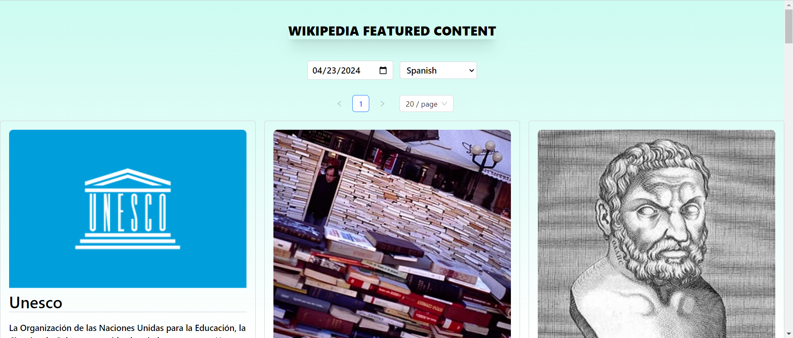
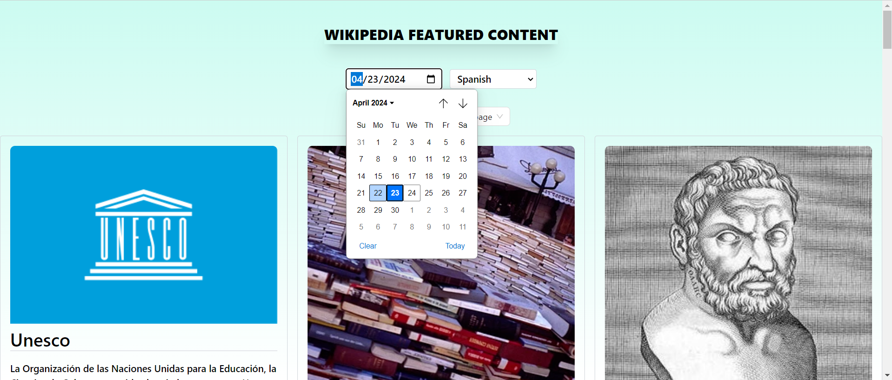
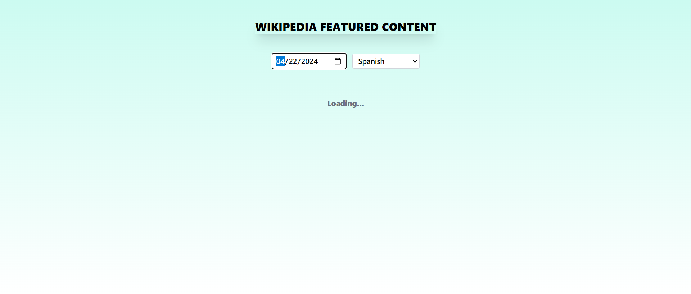
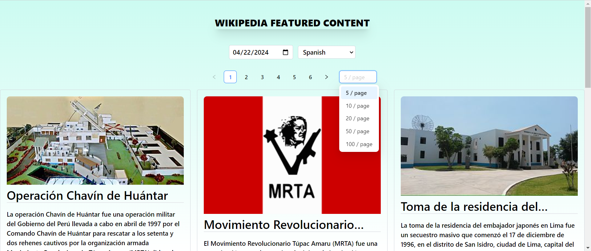

# Wikipedia-Featured-Content

**Below in this document you have some photos for reference.**

**To run the web project React:**

- pnpm install
- pnpm run dev

**To run the API project:**
create the "**.env**" file to send translations API KEY: **RAPIDAPI_API_KEY=166289d9e9c687**
To test the endpoints: you can consult "http://localhost:3000/docs" and in the postman folder it has the files to import the endpoints.
pnpm install
pnpm run start:dev

Functional Requirements
Date and Language Selection
**done** Implement UI elements for date and language selection.
**done** Fetch and display content based on these selections.

Paged Grid Display
**done** Present the content in a grid of cards, with 5 cards per page.
**done** Include pagination controls for page navigation.

Bonus feature:
**done** Enable users to customize the page size.

Card Content
**done** Display the title, thumbnail image (if available), and a brief excerpt or description for each piece of content.

Interaction
**done** Clicking a card opens the featured content in a new tab.
**done** Mark clicked cards as read, with a visual indicator differentiating them from unread content.

Bonus feature:
**done** Persist the 'read' status in the browser's local storage to maintain status across sessions.
**Done** extra: Button to go to the top of the page
done search in two languages English and Spanish

Technology used:
React
React Router
Typescript
Taildwincss
axios
antd component : https://ant.design/

To run the web project:
pnpm install
pnpm run dev

**Backend: Node.js API with NestJS**
/feed
**done** Acts as a proxy to the Wikipedia Featured Content API.
**done** Accepts only GET requests.
**done** Supports all parameters of the Wikipedia API, validating them to ensure correct types and values.
**done** Defines a standard error response format for validation failures and other errors.

/feed/translate/#language
**done** Inherits all functionalities of the /feed endpoint.
**done** Accepts a URL parameter specifying the target language for translation.
**done** Validates the #language parameter to ensure it matches supported languages by the translation service.

**NOTE:\*\***

> The "LibreTranslate API" requested a credit card. So I looked for
> another API "https://www.translate.com/translation-api" but this one
> only allows 1000 test characters, but I attached an image that it
> worked and has some characters left for you to test.

\*\*

create the ".env" file to send translations API KEY: RAPIDAPI_API_KEY=166289d9e9c687

To run the API project:
pnpm install
pnpm run start:dev

